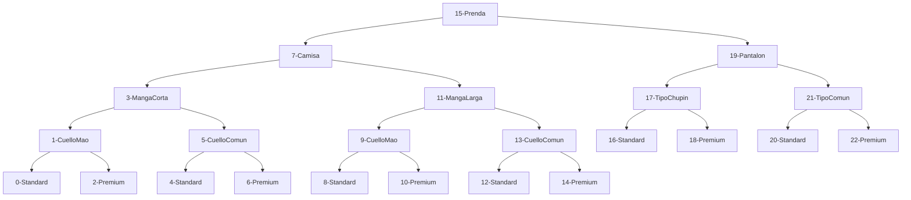

# Hola Quark!

Mi nombre es Erik Zakaryan, agradezco esta oportunidad que me dieron para poder realizar este curso.
En este repositorio les dejo mi Proyecto final del curso de C++.
Espero que les guste!

## Corizador de prendas

Este programa representa un software de una tienda mayorista de ropa, donde permite al vendedor poder cotizar prendas según sus características, y ver el historial de las prendas cotizadas.

### Stock

Para conocer el stock de cada prenda, se utiliza un árbol binario, ya que pueden existir diferentes combinaciones de prendas según las características que tiene.
Las caracteristicas que puede tener una prenda son las siguientes:
- Tipo de Prenda: Puede ser una Camisa o un Pantalon
	- En el caso de que sea Camisa, puede tener:
		- Manga: Larga o Corta
		- Cuello: Mao o Comun
		- Calidad: Standar o Premium
	- En el caso de que sea Pantalon, puede tener:
		- Tipo: Chupin o Comun
		- Calidad: Standar o Premium

A continuacion se puede observar el Arbol binario utilizado en el programa:

Como pueden observar, cada nodo tiene su número, que indica la posición, y esto nos puede servir para poder identificar cada prenda.
Cada camino del árbol es una prenda en especifica, por ejemplo si hacemos el recorrido 15, 7, 11, 9, 8, tenemos una prenda que tiene las siguientes características:
Camisa - Manga Larga - Cuello Mao - Standard

### Cotizador

Cuando comenzamos a cotizar una prenda, lo que hace el programa es ir preguntándonos las características que tiene la prenda que queremos cotizar, el precio unitario de cada prenda y la cantidad a cotizar.
Antes de preguntar la cantidad de prendas que queremos cotizar, consulta el stock para ver cuantas prendas hay disponibles para cotizar, y una vez que se confirma, descuenta del stock la cantidad de prendas que se cotizaron y nos muestra una vista previa.
Para identificar en el stock la prenda, se usa un sistema de "puntaje", que cada prenda arranca en 15, y a medida que se va eligiendo las características, se suman o se restan puntos, para que al final, nos de un numero que coincide con alguna de las raíces del árbol.
El precio total de la cotización varía según las características de la prenda
- Si la camisa es de tipo Manga Corta, el precio se rebaja un 10%
- Si la camisa tiene cuello Mao, el precio aumenta un 3%
- Si la camisa es Manga Corta y Cuello Mao, se aplican las dos reglas anteriores en el orden establecido
- Si el pantalón es Chupín, el precio se rebaja un 12%
- Si la calidad es Standard, no se modifica el precio
- Si la calidad es Premium, aumenta un 30%

### Historial
El programa es capaz de mostrarnos el historial de prendas cotizadas, desde el mas nuevo al mas viejo, mostrándonos los siguientes datos:

- Número de identificación
- Fecha y hora de la cotización
- Código del vendedor
- Prenda cotizada
- Precio unitario
- Cantidad de unidades cotizadas
- Precio Final

Por el momento es todo lo que hace el programa, esperemos que mas adelante se pueda agregarle mas funcionalidades e incluso que se llegue a usar realmente.

Saludos!
